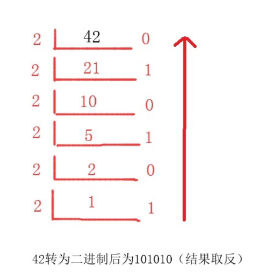
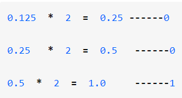
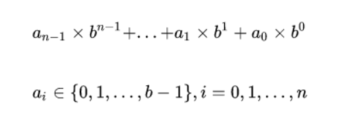

    十进制与二进制之间的转换，一直不得其解，无法理解其中所作操作，一叶障目。今有幸拜读了两篇文章，茅塞顿开。赶紧写个笔记记录一下,希望能记住

十进制与二进制这两种计数方式，本人才疏学浅，就不妄言了，留待以后补充........可参考https://www.wmyskxz.com/

    正文开始

十进制数转化二进制数,采用"除2取余,逆序排列"法:
就是将十进制数除以2,会得到一个商和一个余数,然后继续将商除以2,继续得到一个商和余数.重复此操作,直到商小于1为止

    将正整数42转二进制:

得到结果101010(一定是逆序),补足8位数,为00101010

为什么要补足八位呢?因为二进制数一般分8位、 16位、32位以及64位 表示一个十进制数,所以在转换过程中,最高位会补零,来达到8位、16位、32位或64位.
当超过8位时 就以16位为准补零,当只有四位时 补到8位即可.

    小数转二进制数,采用"乘2取整,顺序排列"法:
    
就是用2乘以十进制小数,可以得到积,将积得整数部分取出来,剩余的小数部分继续乘以2,拿到积得整数位,重复此操作,直到积大于1为止
    将小数0.125转二进制:

    得到结果0.001
如果小数的整数部分有大于0的整数时，将整数部分和小数部分先单独转为二进制，再合在一起就可以了

    8.125转为二进制:
    先将8转为二进制1000,再将0.125转为二进制0.001,合并后得到1000.001

二进制转为十进制要从右到左用二进制的每个数去乘以2的相应次方，小数点后则是从左往右
 
    00101010转为十进制数:

    0*2^7 + 0*2^6 + 1*2^5 + 0*2^4 + 1*2^3 + 0*2^2 + 1*2^1 + 0*2^0(2^7表示2的7次方)
    等于 0 + 0 + 32 + 0 + 8 + 0 + 2 + 0
    等于 42
从右到左用每一位的数乘以2的相应次方,参考https://www.wmyskxz.com/ 中的公式:

其中a指代二进制的每一位数,b指代进制数(如二进制为2),n指代从右向左的位数.

    负整数转二进制
    
在十进制正整数中,采用-123来表示负数,二进制中如果首位(最左位/最高位)是0就表示正整数，1则表示负整数，正整数可以直接换算，负整数则需要先取反再换算。

    byte a = -1，如果只是将最高位变为1，二进制应该是10000001，但实际上，它应该是11111111。
    byte a=-127，如果只是将最高位变为1，二进制应该是11111111，但实际上，它却应该是10000001。
    
和我们的直觉正好相反，这是什么表示法？这种表示法称为补码表示法，而符合我们直觉的表示称为原码表示法，补码表示就是在原码表示的基础上取反然后加1。取反就是将0变为1，1变为0。
负数的二进制表示就是对应的正数的补码表示，比如说：
-1：1的原码表示是00000001，取反是11111110，然后再加1，就是11111111。
-2：2的原码表示是00000010，取反是11111101，然后再加1，就是11111110。
-127：127的原码表示是01111111，取反是10000000，然后再加1，就是10000001。
 ---本段摘自马俊昌著<java编程的逻辑>

    一位大佬的给我的话:负数的实际二进制形式，是其对应正数的补码表现
补码的内容,日后再补充......

参考：https://www.wmyskxz.com/ <java编程的逻辑> https://zhuanlan.zhihu.com/p/75291280